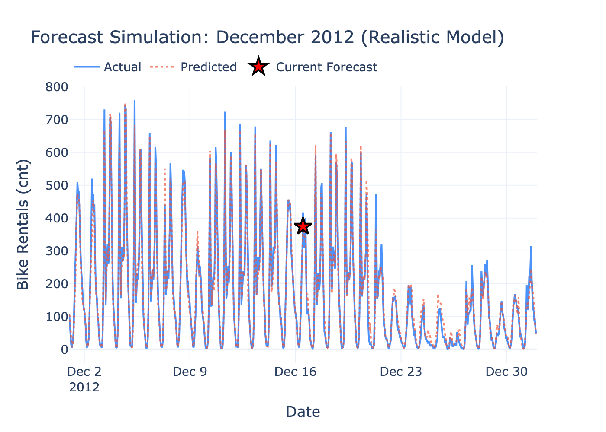

# Business Intelligence - Bike Rental Analytics & BPMN Automation
━━━━━━━━━━━━━━━━━━━━━━━━━━━━━━━━━━━━━━━━━━━━━━━━━━━━━━━━━━━━━━━━━━━━



## Overview
A 2-part Business Intelligence project combining **predictive analytics** with **business process automation** for EU judicial digitization. Built as part of the Business Intelligence course at University of Naples Federico II.

- **Part 1:** Interactive Streamlit dashboard for bike rental demand analysis and ML forecasting (17,379 hourly records)
- **Part 2:** Two BPMN workflows for EU digitization initiatives (DEUCE credit recovery + IDEA labor disputes) using Bonita BPM

## Technologies
```
Python | Streamlit | Scikit-Learn | Random Forest | Plotly
Bonita BPM | BPMN 2.0 | Groovy | LaTeX | Pandas | NumPy
```

## Key Features

### Predictive Analytics Dashboard
- **Real-time forecasting** with interactive time slider for December 2012 predictions
- **Data leakage detection** - demonstrated realistic vs overfitted model (R² 0.9999 → 0.9456)
- **16 interactive visualizations** including heatmaps, decomposition plots, ACF/PACF, PCA scree plots
- **Model comparison** across multiple ML models with RMSE, MAE, R², MAPE metrics
- **Advanced time series analysis** - additive decomposition, Augmented Dickey-Fuller stationarity test

### BPMN Workflow Automation
- **Contest 2 (DEUCE):** 3-lane credit recovery process (Citizen → Clerk → Judge) with 2 XOR gateways, 19 BDM attributes, 3 test scenarios validated
- **Contest 3 (IDEA):** 2-lane labor dispute workflow (Worker → Office) with 4 human tasks, 30 BDM attributes, novel dual-tracking preference system
- **Actor-based access control** with BPMN 2.0 compliant swimlane architecture
- **Groovy gateway conditions** for XOR routing logic

## Technical Highlights

| Metric | With Data Leakage | Realistic Model |
|--------|-------------------|-----------------|
| R² | 0.9999 (fake) | 0.9456 (true) |
| RMSE | 1.21 | 41.01 |
| MAPE | 0.27% | 30.65% |

> The realistic model uses only features available at prediction time: weather forecast, calendar, time of day - demonstrating proper ML methodology.

## Project Structure
```
Time-Series/
├── Streamlit_Dashboard/
│   ├── App_progetto.py           # Home page
│   ├── pages/
│   │   ├── 1AnalisiDati.py       # Data Analysis & KPIs
│   │   ├── 2Forecast.py          # Real-time Prediction
│   │   ├── 3ModelComparison.py   # Multi-model Comparison
│   │   └── 4AdvancedAnalysis.py  # Decomposition, ACF/PACF, PCA
│   ├── models/                   # Trained Random Forest models (.joblib)
│   ├── docs/                     # LaTeX reports + 16 exported figures
│   └── Dataset_Bike.csv          # 17,379 hourly records
├── Bonita_Report/
│   ├── contest-2-deuce.bos       # DEUCE workflow
│   ├── contest-3-idea.bos        # IDEA workflow
│   └── bonita_bpm_report.tex     # LaTeX documentation
└── *.ipynb                       # Jupyter experiments
```

## Results
- **94.56% R²** accuracy on realistic bike demand prediction
- **16 interactive visualizations** generated for the LaTeX report
- **2 complete BPMN workflows** with BDM integration ready for deployment
- **7 test scenarios** validated across both BPM processes

## How to Run
```bash
# Install dependencies
pip install -r Streamlit_Dashboard/requirements.txt

# Run dashboard
streamlit run Streamlit_Dashboard/App_progetto.py

# Open Bonita workflows
# Import .bos files into Bonita Studio (Community Edition)
```

## Links
- **GitHub:** [Repository](https://github.com/shaw-unina/isbi-bike-rental-project)
- **PDF Report:** [Bike Rental Analysis Report](https://github.com/shaw-unina/isbi-bike-rental-project/blob/main/Streamlit_Dashboard/docs/bike_rental_report.pdf?raw=true)
- **BPM Report:** [Bonita BPM Report](https://github.com/shaw-unina/isbi-bike-rental-project/blob/main/Bonita_Report/bonita_bpm_report.pdf?raw=true)
- **Slide Deck:** [Presentation](https://github.com/shaw-unina/isbi-bike-rental-project/blob/main/Streamlit_Dashboard/docs/bike_rental_presentation.pdf?raw=true)
- **BPM Presentation:** [Bonita Presentation](https://github.com/shaw-unina/isbi-bike-rental-project/blob/main/Bonita_Report/bonita_bpm_presentation.pdf?raw=true)

━━━━━━━━━━━━━━━━━━━━━━━━━━━━━━━━━━━━━━━━━━━━━━━━━━━━━━━━━━━━━━━━━━━━
